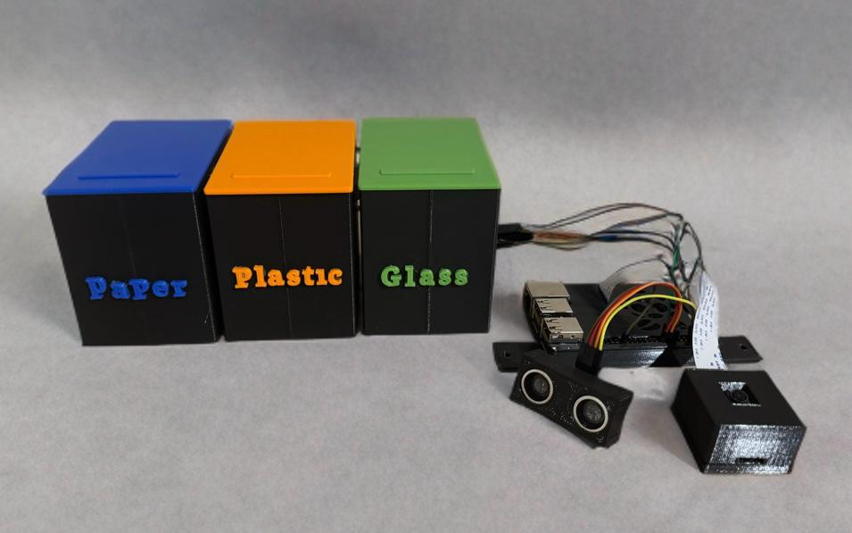

# AutoRecycle



## Overview

AutoRecycle is an intelligent recycling bin prototype designed to promote environmental sustainability through real-time waste classification. This system integrates machine learning and edge AI to classify waste effectively on a resource-constrained device like the Raspberry Pi 3B.

## Features

- **Real-Time Classification**: Classifies waste types using a camera and AI model.
- **Edge Deployment**: Optimized for deployment on low-resource devices.
- **Interactive Design**: Provides feedback via a display to educate users on proper recycling practices.
- **Automated Segregation**: Uses servo motors to direct waste to the appropriate compartment.
- **Modular and Scalable**: 3D-printed bin structure for ease of replication and customization.

## Technical Details

- **AI Model**: Built using EfficientNet-B0 and fine-tuned for custom waste classification datasets.
- **Hardware**: Powered by a Raspberry Pi 3B with integrated distance sensors and servo motors.
- **Optimization**: Includes knowledge distillation to create a lightweight student model for efficient deployment.

## Datasets

- **Public Dataset**: Used for initial model training, sourced from Kaggle.
- **Custom Dataset**: Fine-tuned on real-world images for improved accuracy and relevance.

## Performance

- **Teacher Model**: Achieved 90% accuracy on the test set.
- **Student Model**: Lightweight version with 88.5% accuracy for edge deployment.
- **Inference Time**: Approximately 5 seconds from detection to classification.

## Challenges

- **Lighting Variations**: Accuracy decreases in low-light conditions.
- **Edge Cases**: Misclassification of visually similar objects.
- **Hardware Constraints**: Limited by the computational power of Raspberry Pi 3B.

## Future Improvements

- Expand dataset to include more waste categories and scenarios.
- Explore advanced AI architectures for better generalization.
- Optimize hardware for reduced inference latency.
- Introduce additional features like waste volume prediction.

## Getting Started

1. **Clone the Repository**:
   ```bash
   git clone https://github.com/your-repo-name/AutoRecycle.git
